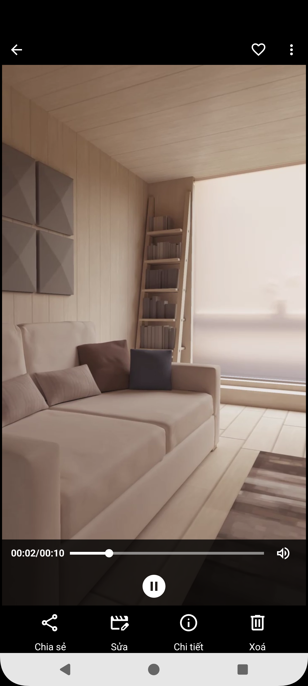
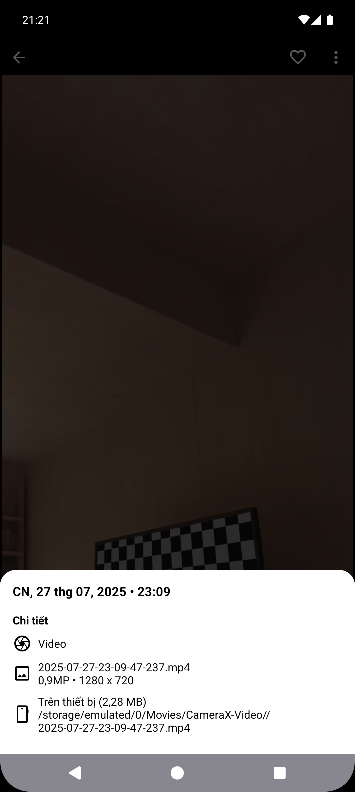
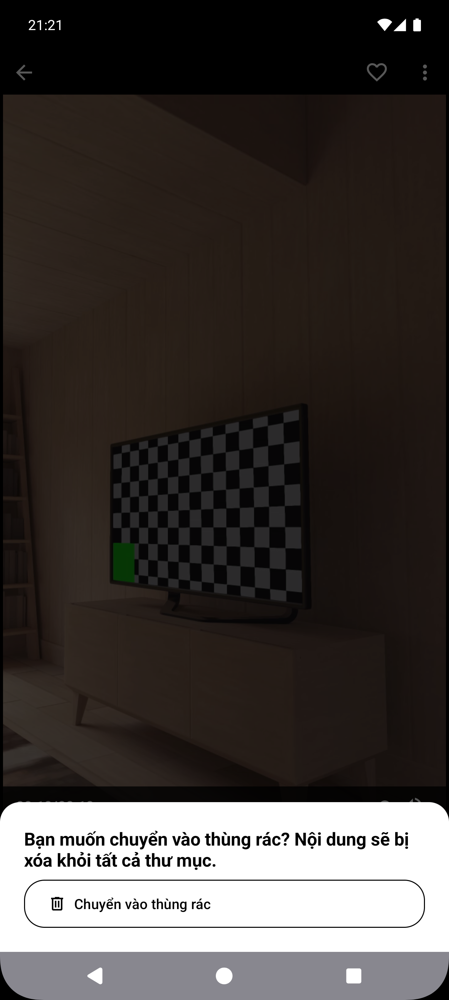
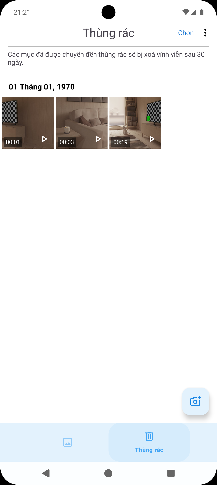
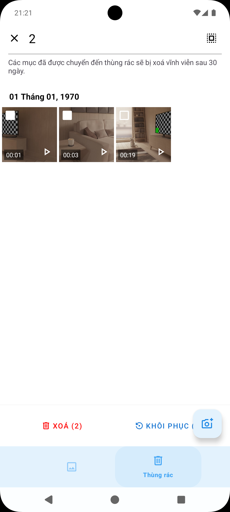
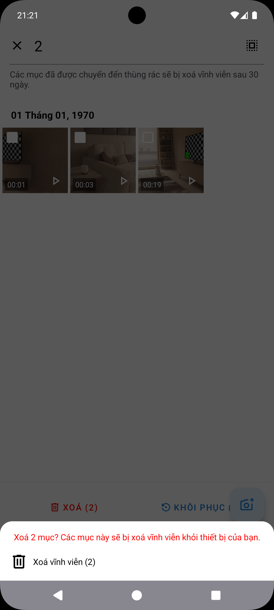
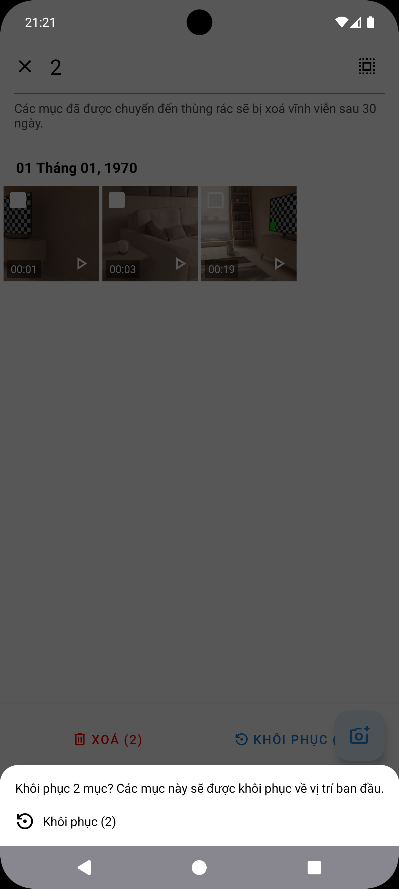
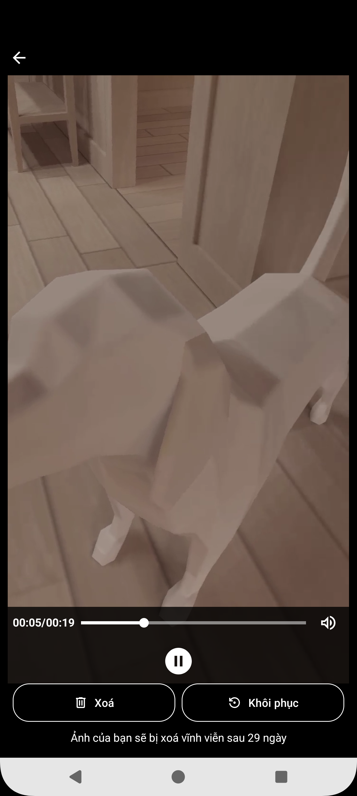
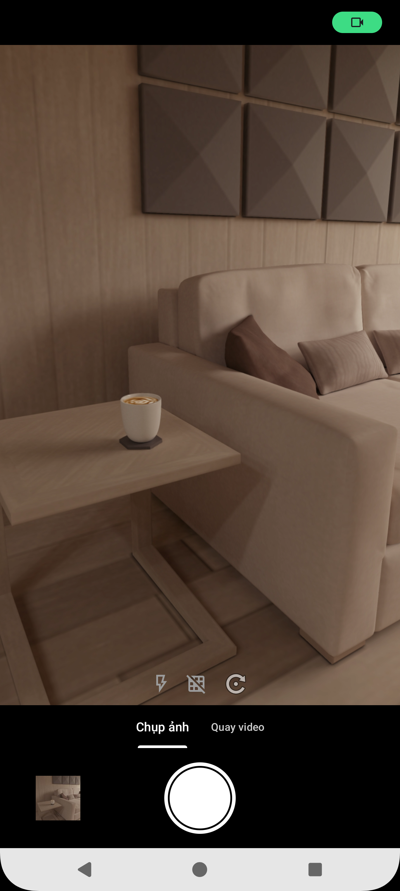
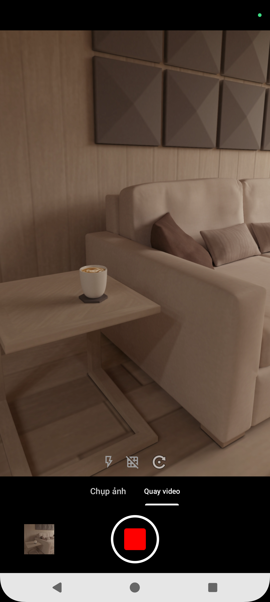

# ShutterFrame App - Android Application

## 📱 Giới thiệu

**ShutterFrame** là ứng dụng Android được phát triển bằng **Kotlin XML** trên nền tảng **Android** kết hợp với MediaStore để thực hiện chức năng quay, chụp lưu ảnh và video.

## Ảnh chụp giao diện ứng dụng
<table>
  <tr>
    <td>Trang chính</td>
    <td>Chi tiết Item</td>
    <td>Xem thông tin chi tiết</td>
    <td>Xoá item</td>
  </tr>
  <tr>
    <td></td>
    <td></td>
    <td></td>
    <td></td>
  </tr>
  <tr>
    <td colspan="4"></td>
  </tr>
  <tr>
    <td>Màn hình thùng rác</td>
    <td>Chọn mục để xoá/khôi phục</td>
    <td>Xoá nhiều mục</td>
    <td>Khôi phục nhiều mục</td>
  </tr>
  <tr>
    <td></td>
    <td></td>
    <td></td>
    <td></td>
  </tr>
  </table>
  <table>
  <tr>
    <td>Chi tiết mục trong thùng rác</td>
    <td>Chụp ảnh</td>
    <td>Quay video</td>
  </tr>
  <tr>
    <td></td>
    <td></td>
    <td></td>
  </tr>
  <tr>
    <td colspan="3"></td>
  </tr>
</table>
  
## 🛠 Công nghệ sử dụng

### Frontend (Android App)
- **Ngôn ngữ**: Kotlin
- **Lưu trữ**: MediaStore
- **IDE**: Android Studio
- **Version Control**: GitHub

### Các bước cài đặt
1. Clone repository:
   ```bash
   git clone https://github.com/chaolaolo/ShutterFrame.git
   ```
2. Mở project bằng Android Studio
3. Đồng bộ Gradle và tải các dependencies
4. Chạy ứng dụng trên máy ảo hoặc thiết bị thật

**Liên hệ với tôi**: 
- Chảo Láo Lở - [chaolaolo290604@gmail.com](mailto:chaolaolo290604@gmail.com).
- Zalo: 0396 471 382
